# CritKeyPro

Fast rubric grading application with keyboard shortcuts designed for Canvas LMS. Grade assignments faster with a keyboard-driven workflow, Canvas integration, and automatic feedback generation.

**All data stored locally in your browser** - no accounts, no uploads, complete privacy.

> **🚀 Developers:** Running locally? You need BOTH servers running - see [Quick Start for Local Development](#quick-start-for-local-development)

---

## Table of Contents

- [For Educators: User Guide](#for-educators-user-guide)
  - [Getting Started](#getting-started)
  - [Canvas Integration](#canvas-integration)
  - [Setting Up Your Rubrics](#setting-up-your-rubrics)
  - [Main Grading Workflow](#main-grading-workflow)
  - [PDF Viewer Features](#pdf-viewer-features)
  - [Generating and Managing Feedback](#generating-and-managing-feedback)
  - [Advanced Features](#advanced-features)
  - [Keyboard Shortcuts Reference](#keyboard-shortcuts-reference)
  - [Tips for Efficient Grading](#tips-for-efficient-grading)
  - [Privacy & Data Storage](#privacy--data-storage)
  - [Troubleshooting](#troubleshooting)
- [For Developers](#for-developers)
  - [Development Setup](#development-setup)
  - [Building](#building)
  - [Deployment](#deployment)
  - [Architecture Overview](#architecture-overview)

---

## For Educators: User Guide

### Overview

CritKeyPro is designed to make rubric-based grading significantly faster and more efficient. Use it standalone with CSV imports, or connect directly to Canvas to view student PDFs and sync grades. All your work is saved locally in your browser, ensuring your grading data stays private and secure.

### Getting Started

#### Three Ways to Use CritKeyPro

**1. Standalone Mode** (without Canvas):

- Import Canvas rubric CSV files
- Grade assignments offline
- Copy feedback to paste into Canvas manually
- Perfect for privacy-conscious grading

**2. Canvas Integration Mode**:

- Connect directly to your Canvas account
- View student PDFs within the app
- Stage grades that can sync back to Canvas
- Navigate between student submissions seamlessly

**3. Offline Mode** (Canvas with PDF caching):

- Download all PDFs for offline grading
- Grade without an internet connection
- Perfect for grading on the go

#### Initial Setup

1. **Open the Side Panel**: Click the blue tab on the left edge of the screen to reveal the setup panel
2. **Choose Your Course**: Select a course from the dropdown (you can organize rubrics by course)
3. **Import or Create a Rubric**: Either:
   - Import a Canvas rubric CSV file, or
   - Create a new rubric from scratch
4. **Optional: Connect to Canvas**: Enter your Canvas API token to enable full integration

---

### Canvas Integration

#### Connecting to Canvas

**Step 1: Get Your API Token**

1. Log into Canvas
2. Go to Account → Settings → Approved Integrations
3. Click "+ New Access Token"
4. Give it a purpose (e.g., "CritKeyPro")
5. Copy the generated token

**Step 2: Configure CritKeyPro**

1. Open the side panel
2. Find the "Canvas Integration" section
3. Paste your API token
4. Enter your Canvas URL (usually auto-filled, e.g., `https://canvas.instructure.com`)
5. Click "Save & Connect"

Once connected, you'll see your Canvas courses and assignments in the interface.

#### Navigating Canvas Content

**Course Selection**

- Choose which course you're grading for from the dropdown
- Only your active courses appear

**Assignment Categories**

- Filter assignments by category (Homework, Quizzes, Projects, etc.)
- Select "All Categories" to see everything
- Categories come from your Canvas course structure

**Assignment Selection**

- Pick the assignment you want to grade
- Shows: assignment names, point values
- Only published assignments with submissions appear

**Student Navigation**

- Navigate between students using arrow buttons or keyboard shortcuts (`Ctrl+Shift+←` / `Ctrl+Shift+→`)
- Students appear in order
- Progress indicator shows "Student X of Y"
- Each student's rubric state saves separately

#### Offline Mode & PDF Caching

**Why Cache PDFs?**

- Grade without internet connection
- Faster loading (PDFs load from your computer, not Canvas)
- Work on planes, trains, or anywhere

**How to Cache PDFs**

1. Enable "Offline Mode (Cache PDFs for offline grading)" toggle
2. Select an assignment
3. Click "Cache All PDFs for This Assignment"
4. Wait for download to complete (progress bar shows status)
5. PDFs are now stored locally and available offline

**Parallel Download Settings**

- Control how many PDFs download simultaneously
- Higher number = faster overall, but longer wait for first PDF
- Set to 0 for unlimited (all at once)
- Default: 3 at a time
- Adjust based on your internet speed

**Cache Manager**

- Click the storage icon to view cached assignments
- See storage used by each assignment
- Delete individual assignments to free space
- Clear all cache at once if needed
- Cached PDFs persist until manually deleted or browser data cleared

---

### Setting Up Your Rubrics

#### Importing Canvas Rubrics

**From Canvas CSV Export**

1. In Canvas, go to your assignment's rubric
2. Export as CSV file
3. In CritKeyPro:
   - Open the side panel → Setup section
   - Select your course first
   - Click "Import Canvas Rubric CSV" or drag the file to the import area
   - The rubric appears in your rubric list

**Supported CSV Format**

- Canvas rubric export format
- Each row is one criterion
- Levels grouped in columns (Name, Description, Points)
- Automatically sorted by points (highest first)

#### Creating Rubrics from Scratch

1. Click "Create New Rubric" button
2. Enter a name for your rubric
3. A basic rubric with one criterion appears
4. Use "Manage Criteria" to customize:
   - Add more criteria
   - Name each criterion
   - Add levels (grade options) for each criterion
   - Set point values
   - Add descriptions

#### Managing Multiple Courses

**Organizing by Course**

- Each course has its own set of rubrics
- Keeps your rubrics organized by class
- Switch courses using the course dropdown
- Canvas courses sync automatically

**Adding Courses**

- Courses are added automatically when you:
  - Import a rubric for that course
  - Create a rubric with a course selected
  - Connect via Canvas integration

#### Rubric Management Features

**Renaming Rubrics**

- Click the edit icon next to the rubric dropdown
- Enter new name
- Changes apply immediately and persist

**Duplicating Rubrics**

- Click the duplicate icon
- Creates exact copy with " (Copy)" appended to name
- Perfect for creating variants of similar rubrics
- Grading selections reset on duplicates

**Deleting Rubrics**

- Click the delete icon
- Confirmation required to prevent accidents
- Permanently removes rubric from course

**Downloading Rubrics**

- Click "Download Rubrics" button
- Select one or multiple rubrics with checkboxes
- **Single rubric**: Downloads as CSV file (e.g., `RubricName_2024-11-15.csv`)
- **Multiple rubrics**: Downloads as ZIP file containing all CSVs (e.g., `rubrics_3_items_2024-11-15.zip`)
- Files include timestamp in filename
- Re-import into Canvas or share with colleagues

---

### Main Grading Workflow

#### The Grading Interface

When you select a rubric, you'll see:

1. **Student Name Field** (optional): Label your feedback with student name for history tracking
2. **Current Criterion**: Shows which criterion you're grading (e.g., "Criterion 2 of 5")
3. **Criterion Name & Description**: What you're evaluating
4. **Level Buttons**: Numbered buttons for each grade level (1 = highest points)
5. **Comment Field**: Add optional feedback for each criterion
6. **Navigation Buttons**: Move between criteria
7. **Criterion Overview**: Visual chips showing progress at bottom
8. **Total Points Display**: Running total of earned vs. possible points in left panel

#### Step-by-Step Grading Process

**For Each Student:**

**1. Review the Work**

- Student PDF appears in the right panel (Canvas integration)
- Or view work in separate window/tab (standalone mode)

**2. Grade Each Criterion**

- Read the criterion name and description
- Select the appropriate level:
  - **With keyboard**: Press number keys `1`-`9` (1 = highest points)
  - **With mouse**: Click the level button
- Selected level highlights in blue
- Total score updates automatically
- Criterion chip turns green to show completion

**3. Add Comments (Optional)**

- **With keyboard**: Press `C` to jump to comment field
- **With mouse**: Click in the comment box
- Type additional feedback specific to this criterion
- Press `Esc` to exit comment field and re-enable shortcuts

**4. Navigate Between Criteria**

- **Next criterion**: Press `N` or `→` (or click "Next" button)
- **Previous criterion**: Press `P` or `←` (or click "Previous" button)
- **Jump to any criterion**: Click criterion chips at bottom
- If auto-advance is enabled, automatically moves to next after selecting level

**5. Review Your Work**

- Check total score in left panel (points and percentage)
- Click any criterion chip to jump back and review/change selections
- Green chips = graded, gray chips = ungraded, blue chip = current

**6. Generate Feedback**

- Press `Ctrl+Enter` (Windows/Linux) or `Cmd+Enter` (Mac)
- Or click "Generate Feedback" button
- Feedback automatically copies to clipboard
- Paste into Canvas or save for records

**7. Move to Next Student** (Canvas integration)

- Click "Stage Grade" to save grade and advance
- Or press `Ctrl+Shift+→` to navigate manually
- Grading selections reset automatically for next student

---

### PDF Viewer Features

#### Zoom Controls

**Zoom In/Out**

- Click `+` or `-` buttons
- Or use slider for precise control
- Reset button returns to default zoom (100%)
- Current zoom percentage displays in controls

**Initial Page Zoom Setting**

- Open PDF settings (gear icon)
- Set default width: 10-200%
- Default: 90% (fills most screens)
- Adjust based on your monitor size
- Setting persists across sessions

#### Grid Mode (Multi-Page View)

**Why Use Grid Mode?**

- View multiple pages side-by-side
- Perfect for multi-page essays
- Compare different sections
- See overall document structure

**How to Enable**

1. Click PDF settings (gear icon)
2. Toggle "Grid Mode" on
3. Set number of pages across (1-10 columns)
4. Pages arrange in grid layout
5. Scroll through entire document

**Best Uses**

- 2 columns: Compare two pages
- 3+ columns: Overview of entire essay
- Single column: Default reading mode

#### Page Navigation

**Scrolling**

- Scroll normally through pages
- Continuous view (no page breaks)

**Arrow Buttons**

- Jump to previous/next page
- Shows current page count (e.g., "Page 3 of 5")

**Multi-Page Documents**

- All pages load automatically
- Smooth scrolling between pages
- Page numbers display in viewer

#### Student Navigation (Canvas Integration)

**Previous/Next Student**

- Buttons at top of PDF viewer
- Keyboard shortcuts: `Ctrl+Shift+←` and `Ctrl+Shift+→`
- Shows "Student X of Y"
- Progress indicator helps track remaining work
- Each student's PDF loads automatically

---

### Generating and Managing Feedback

#### Creating Feedback

**Quick Method (Keyboard)**

1. Finish grading all criteria
2. Press `Ctrl+Enter` (Windows/Linux) or `Cmd+Enter` (Mac)
3. Feedback generates and copies to clipboard automatically
4. Small notification confirms copy
5. Paste into Canvas or other destination

**Full Method (Dialog)**

1. Click "Generate Feedback" button
2. Dialog opens showing formatted feedback
3. Edit text if needed
4. Click "Copy to Clipboard" if needed
5. Click "Close" when done

#### Feedback Format

The generated feedback includes:

- Rubric name
- Each graded criterion with:
  - Points earned / possible points
  - Criterion name
  - Selected level name
  - Level description
  - Your comments (if added)
- Total score at bottom

**Example:**

```
Rubric: Essay Writing - Fall 2024

8/10 — Thesis Statement (Clear and focused): Your thesis clearly
identifies the main argument. Consider making it more specific.
  Note: Great start! Try narrowing your focus to one aspect.

10/10 — Organization (Excellent): Essay flows logically with
clear transitions between paragraphs.

6/10 — Evidence (Developing): More sources needed to support claims.
  Note: Add at least 2 more scholarly sources from peer-reviewed journals.

7/10 — Grammar (Good): Few grammatical errors that don't impede understanding.

Total: 31/40 points (77.5%)
```

#### Feedback History

**Accessing Recent Feedback**

1. Click dropdown arrow next to "Generate Feedback" button
2. Shows last 5 feedback entries
3. Each entry displays:
   - Student name (if you entered it) or rubric name
   - Timestamp (date and time)
   - Preview of feedback text

**Using History**

- Click any entry to view full feedback again
- Copy to clipboard
- Perfect for:
  - Reviewing what you told students
  - Regenerating lost feedback
  - Comparing feedback across students

#### Student Naming

**Optional Labels**

- Field appears at top of first criterion
- Enter student name or identifier
- Appears in:
  - Feedback history (for easy tracking)
  - Generated feedback
- Helps organize multiple graded rubrics
- Clears when you reset for next student

#### Canvas Grade Submission

**Staging Grades** (Canvas Integration Only)

1. Complete grading all criteria
2. Click "Stage Grade" button (green button)
3. Grade and feedback save to staging area
4. Automatically advances to next student
5. Grading selections reset for next student

**What is Staging?**

- Grades are saved locally, not yet in Canvas
- Review all grades before pushing to Canvas
- Make changes if needed before final submission
- Future feature: Push multiple grades at once

---

### Advanced Features

#### LaTeX Math Support

**Mathematical Expressions**

- Use `$$expression$$` syntax in:
  - Criterion names
  - Criterion descriptions
  - Level names
  - Level descriptions
- Example: `$$x^2 + y^2 = r^2$$` displays as beautifully formatted equation
- In generated feedback, converts to Canvas-compatible format: `\(x^2 + y^2 = r^2\)`

**Where LaTeX Works**

- Import from Canvas CSV files
- Create/edit in rubric editor
- Live preview in grading interface
- Generated feedback (auto-converted for Canvas)

**Perfect For**

- Math courses (equations, formulas)
- Science courses (chemical formulas, physics equations)
- Statistics (probability notation)
- Any course requiring mathematical notation

#### Window Management & Dockable Panels

The rubric grading interface can be positioned multiple ways for your workflow:

**Floating Window** (default)

- Draggable window over PDF
- Move anywhere on screen
- Resize by dragging corners
- Shows rubric title bar with drag handle
- Best for: Single monitor, flexibility

**Docked Positions**
Drag the rubric panel to screen edges to dock:

- **Left Dock**: Rubric panel on left, PDF on right

  - Fixed position, resizable divider
  - Best for: Wide monitors, left-handed grading

- **Right Dock**: PDF on left, rubric panel on right

  - Fixed position, resizable divider
  - Best for: Wide monitors, right-handed grading

- **Top Dock**: Rubric panel above PDF
  - Fixed position, resizable divider
  - Best for: Vertical monitors, large PDFs

**Undocking**

- Click "Undock" button in docked panels
- Returns to floating window mode
- Position preference saves automatically

**Choosing Your Layout**

- Experiment with different positions
- Adjust based on:
  - Monitor size/orientation
  - Personal preference
  - Type of assignments (short vs. long PDFs)
- Position persists across sessions

#### Inline Rubric Editing

You can modify rubrics without re-importing from Canvas.

**Editing Individual Levels** (During Grading)

1. **To edit an existing level**:

   - Click the pencil icon next to any level button
   - Dialog opens with:
     - Level name field (e.g., "Excellent", "Good", "Needs Improvement")
     - Points value field
     - Description text area
   - Preview shows how it will appear
   - Click "Save Changes"
   - Changes apply immediately and persist to rubric

2. **To add a new level**:

   - Click "Add Item" button below levels
   - Fill in name, points, and description
   - Click "Add Level"
   - New level automatically sorts into correct position (by points, descending)

3. **To delete a level**:
   - Click pencil icon to edit the level
   - Click red "Delete Level" button
   - Confirm deletion
   - Level removes permanently

**What Happens**

- Changes save immediately to localStorage
- Rubric updates throughout app
- When you download rubric, changes included
- No need to re-import to Canvas unless you want to

**Managing Criteria** (Bulk Editing)

For comprehensive rubric customization:

1. Click **"Manage Criteria"** button at bottom of criterion overview
2. Dialog opens showing all criteria with full editor

**Available Actions:**

- **Reorder Criteria**:

  - Use up/down arrow buttons next to each criterion, or
  - Drag criteria using the drag handle icon (6 dots)
  - Changes order throughout grading interface

- **Rename Criteria**:

  - Edit text directly in "Criterion Name" field
  - Edit "Criterion Description" field
  - Changes persist immediately

- **Show/Hide Descriptions**:

  - Click "Show Description" to expand
  - Edit description in text area
  - Supports LaTeX (`$$` syntax)

- **Edit Levels for a Criterion**:

  - Click "Edit Levels" for any criterion
  - Add, edit, or remove levels inline
  - Set name, points, description for each
  - Click "Save Levels" when done
  - Levels auto-sort by points

- **Add New Criteria**:

  - Click "Add Criterion" at bottom, or
  - Click "Add Criterion Below" under any criterion to insert at specific position
  - Set name, description, and levels

- **Delete Criteria**:
  - Click red trash icon for criterion
  - Confirm deletion
  - Cannot be undone

3. Click **"Save Changes"** when finished

**Why It's Useful**

- Make quick adjustments without going back to Canvas
- Fine-tune rubrics based on assignment variations
- Add criteria you forgot in Canvas
- Reorder criteria to match your grading preferences
- Adapt rubrics on the fly

#### Criterion Navigation & Overview

**Quick Navigation**

- Criterion chips appear at bottom of grading panel
- Shows all criteria at a glance
- Click any chip to jump directly to that criterion

**Color Coding**

- **Blue (filled)**: Current criterion being graded
- **Green (outline)**: Completed (level selected)
- **Gray (outline)**: Not yet graded

**Visual Progress**

- Instantly see completion status
- Total possible points shown
- Helps ensure nothing is missed

#### Per-Submission Rubric State (Canvas Integration)

**Automatic Saving**
When using Canvas integration, each student's rubric state saves separately:

- Grade Student A partially
- Navigate to Student B
- Grade Student B completely
- Return to Student A
- All Student A's selections and comments restore exactly as you left them

**What Gets Saved Per Student**

- Selected levels for each criterion
- Comments for each criterion
- Current criterion position
- Total score

**How It Works**

- States organized by:
  - Assignment ID
  - Student ID
  - Rubric selections and comments
- Persists across browser sessions
- Stored in localStorage
- Clears when you reset or stage grade

**Why It's Useful**

- Switch between students without losing work
- Return to partially graded submissions
- Review previous student while grading next
- No data loss from interruptions

#### Keyboard Shortcut Customization

**Accessing Customization**

1. Press `?` key, or
2. Click keyboard icon in interface
3. Click "Customize Hotkeys" button
4. List of all shortcuts appears with current bindings

**Changing Shortcuts**

- Click any shortcut row to edit
- Press new key combination
- Multiple alternatives supported (separated by commas)
  - Example: "n, right" means both N and → work
- Modifiers supported: Ctrl, Cmd, Shift, Alt
- Validation prevents:
  - Invalid combinations
  - Conflicts with existing shortcuts
- Changes save automatically
- Reset to defaults anytime with "Reset to Defaults" button

**Best Practices**

- Choose keys easy to reach while viewing PDF
- Single keys for frequent actions (1-9 for levels)
- Modifiers for less frequent actions (Ctrl+Enter for feedback)
- Avoid conflicts with browser shortcuts (Ctrl+T, Ctrl+W, etc.)
- Test shortcuts before committing to them

**Common Customizations**

- Change navigation from N/P to J/K (Vim-style)
- Use arrow keys exclusively
- Set up left-hand shortcuts for mouse-right users
- Create muscle memory friendly combinations

#### Grading Settings

**Auto-Advance** (Toggle Switch)

- **When ON**: Automatically moves to next criterion after selecting a level
  - Speeds up grading flow
  - Best for: Quick grading, consistent rubrics
- **When OFF**: Stay on current criterion after selecting
  - Press `Space`, `N`, or `→` to advance manually
  - Gives time to add comments or review
  - Best for: Detailed feedback, varied grading

**Correct by Default** (Toggle Switch)

- **When ON**: Automatically selects highest points for all criteria
  - Speeds up grading excellent work
  - Start at 100%, adjust down for errors
  - Perfect for: High-performing students
- **When OFF**: Start with no selections
  - Grade each criterion from scratch
  - Best for: Varied performance, detailed evaluation

**Combining Settings**

- Both ON: Fastest possible grading (adjust only errors)
- Auto-advance ON, Correct by default OFF: Fast but thorough
- Both OFF: Maximum control and deliberation

---

### Keyboard Shortcuts Reference

All keyboard shortcuts shown at bottom of screen and customizable. Default shortcuts:

#### Essential Shortcuts

| Action                                      | Shortcut                                      | Description                                    |
| ------------------------------------------- | --------------------------------------------- | ---------------------------------------------- |
| **Level Selection**                         |
| Select Level 1-9                            | `1` - `9`                                     | Select rubric levels (1 = highest points)      |
| **Criterion Navigation**                    |
| Next Criterion                              | `N` or `→`                                    | Move to next criterion                         |
| Previous Criterion                          | `P` or `←`                                    | Move to previous criterion                     |
| Next (Space)                                | `Space`                                       | Move to next criterion (when auto-advance off) |
| **Comments**                                |
| Focus Comment                               | `C`                                           | Jump to comment field                          |
| Unfocus Comment                             | `Esc`                                         | Exit comment field, re-enable shortcuts        |
| **Feedback & Grading**                      |
| Generate Feedback                           | `Ctrl+Enter` (Win/Linux)<br>`Cmd+Enter` (Mac) | Generate and copy feedback to clipboard        |
| Reset Rubric                                | `Ctrl+R` (Win/Linux)<br>`Cmd+R` (Mac)         | Clear all selections for next student          |
| **Student Navigation** (Canvas Integration) |
| Next Student                                | `Ctrl+Shift+→`<br>`Cmd+Shift+→` (Mac)         | Advance to next submission                     |
| Previous Student                            | `Ctrl+Shift+←`<br>`Cmd+Shift+←` (Mac)         | Return to previous submission                  |
| **Help & Settings**                         |
| Show Shortcuts                              | `?`                                           | Open keyboard shortcuts reference              |
| Customize Shortcuts                         | `?` then "Customize"                          | Edit keyboard shortcut bindings                |

#### Efficient Grading Workflow Examples

**Fastest Workflow (Standalone)**

1. Review student work (separate window/tab)
2. Press `1`-`9` to select levels (auto-advances if enabled)
3. Press `C` to add comment only when needed, `Esc` to exit
4. Press `Ctrl+Enter` to generate and copy feedback
5. Paste feedback into Canvas
6. Press `Ctrl+R` to reset for next student
7. Repeat

**Fastest Workflow (Canvas Integration)**

1. Review student work in PDF viewer (right panel)
2. Press `1`-`9` to select levels (auto-advances if enabled)
3. Press `C` for comments when needed, `Esc` to exit
4. Click "Stage Grade" (or `Ctrl+Enter`)
5. Automatically advances to next student
6. Repeat

**Detailed Feedback Workflow**

1. Review work thoroughly
2. Grade each criterion with `1`-`9`
3. Press `C` to add detailed comment for each criterion
4. Press `Esc` to exit comment, `N` to move to next
5. Review all selections by clicking criterion chips
6. Press `Ctrl+Enter` to generate feedback
7. Review in dialog, edit if needed
8. Copy and paste into Canvas

---

### Tips for Efficient Grading

#### Speed Grading Tips

1. **Use Auto-Advance**: Enable in settings for fastest workflow
2. **Correct by Default**: Enable when most students earn full points
3. **Keyboard Only**: Avoid mouse after initial setup (number keys + navigation)
4. **Prepare Common Comments**: Keep frequently-used feedback in text file to copy/paste
5. **Batch Similar Work**: Grade similar assignments together for consistency
6. **Cache PDFs**: Download all PDFs first for offline grading (no loading delays)
7. **Learn Shortcuts**: Memorize 1-9 for levels, N for next, C for comment, Ctrl+Enter for feedback
8. **Develop Rhythm**: Look → Number → Next → Repeat (add comments only when needed)

#### Organization Tips

1. **Meaningful Names**: Use clear rubric names (e.g., "Essay 1 - Fall 2024")
2. **One Course Per Rubric Set**: Keep rubrics organized by course
3. **Version Your Rubrics**: Duplicate and modify rather than overwriting originals
4. **Download Backups**: Export rubrics periodically to protect against data loss
5. **Label Feedback**: Use student names in feedback for tracking
6. **Organize Courses**: Use Canvas course names or create logical course IDs

#### Best Practices

1. **Enter Student Names**: Takes just seconds, makes feedback history useful
2. **Review Before Generating**: Use criterion chips to quickly review all selections
3. **Save Feedback as You Go**: Generate feedback immediately after grading each student
4. **Use Comments Strategically**: Don't repeat the same comment - consider adding to rubric description instead
5. **Check Total Score**: Glance at score display to ensure it matches your assessment
6. **Customize Your Layout**: Find window position (floating/docked) that works for your setup

#### Common Workflows

**Workflow 1: High-Performing Students**

1. Enable "Correct by default"
2. Enable "Auto advance"
3. Scan work for any issues
4. Press numbers only for criteria where points were lost
5. Add brief comments explaining deductions
6. Press Ctrl+Enter to generate feedback
7. Stage grade (Canvas) or paste feedback (standalone)

**Workflow 2: Detailed Feedback Needed**

1. Disable "Auto advance" (gives time for comments)
2. Select level for each criterion with number keys
3. Press C to add comments for most or all criteria
4. Use Esc to exit comment boxes
5. Review all criteria using chips
6. Generate feedback and review in dialog
7. Edit feedback if needed before copying

**Workflow 3: Fast Grading (Canvas Integration)**

1. Enable "Auto advance" and optionally "Correct by default"
2. Cache all PDFs first for offline work
3. Work through criteria using only keyboard (1-9, N)
4. Skip comments unless necessary
5. Click "Stage Grade" to save and auto-advance
6. Repeat for all students in assignment
7. Review staged grades before final submission

---

### Privacy & Data Storage

#### How Your Data is Stored

**Browser Local Storage**
CritKeyPro uses browser localStorage technology (like cookies but with more space):

- Everything saves in your browser only
- No data sent to external servers (except Canvas API when you use integration)
- Works completely offline (without Canvas)
- Data persists until you clear browser data

**What Gets Stored**

- Rubrics you import or create
- Your grading selections and comments (per student with Canvas)
- Course information
- All settings (zoom, auto-advance, correct-by-default, etc.)
- Feedback history (last 5 entries)
- Canvas API token (if using integration) - encrypted in browser
- Cached PDFs (if offline mode enabled)
- Window position preferences
- Custom keyboard shortcuts

#### Canvas Integration Privacy

**API Token**

- Stored only in your browser's localStorage
- Used to fetch courses, assignments, submissions, PDFs
- Never sent to third parties
- Never sent to CritKeyPro servers (there are none!)
- Revoke anytime in Canvas → Account → Settings → Approved Integrations

**What Canvas Integration Accesses**
When you provide API token, CritKeyPro can:

- Read your course list
- Read assignments within your courses
- Read student submissions for your assignments
- Download PDF attachments from submissions
- Write grades/feedback to gradebook (when you push grades)

**What It Does NOT Access**

- Student personal information beyond name
- Other instructors' data
- Courses you're not enrolled in
- Student emails or contact information
- Any data outside your Canvas permissions

**Data Flow**

- API requests: Your browser ↔ Canvas (direct, encrypted)
- No intermediary servers
- No data collection by CritKeyPro
- Complete FERPA compliance (no third-party data sharing)

#### Data Security Benefits

The local-only storage approach means:

- **Student Privacy Protected**: No student data ever leaves your computer (except direct Canvas sync)
- **FERPA Compliant**: No third-party servers have access to student information
- **No Accounts Needed**: No passwords to remember, no accounts to create
- **No Security Breaches**: Since there's no central server, there's nothing for hackers to breach
- **Offline Capable**: Grade anywhere, anytime, no connection required (with cached PDFs)
- **Complete Control**: You control when data is deleted

#### Important Limitations

Because data is stored in your browser:

1. **Different Browsers = Different Data**

   - Rubrics saved in Chrome won't appear in Firefox
   - Use same browser consistently

2. **Different Computers = Different Data**

   - Work on laptop won't appear on desktop
   - Export rubrics to transfer between computers

3. **Clearing Browser Data = Losing Your Rubrics**

   - If you clear browser cache/cookies/localStorage, you lose saved rubrics
   - Always download backups before clearing

4. **Private/Incognito Mode**

   - Data may not persist when you close private browsing windows
   - Use normal browsing mode for persistent storage

5. **Storage Limits**
   - LocalStorage typically: 5-10 MB
   - Cached PDFs can use significant space
   - Use Cache Manager to monitor and clear as needed

#### Backing Up Your Data

**Export Rubrics**

- Use "Download Rubrics" feature regularly
- Saves Canvas-compatible CSV files
- Import later if data lost
- Share rubrics with colleagues
- Keep copies in cloud storage (Google Drive, Dropbox, etc.)

**No Automatic Backup**

- Since data is local-only, no cloud backup
- Create manual backups by downloading
- Schedule regular exports (weekly, monthly)

**Restoring Data**

- Re-import CSV files using "Import Canvas Rubric CSV"
- Rubrics restore with all criteria and levels
- Grading selections don't restore (only rubric structure)

#### Clearing Your Data

**Clear Specific Data**

- **Delete individual rubrics**: Click delete icon next to rubric
- **Clear PDF cache**: Use Cache Manager → delete assignments or clear all
- **Reset grading**: Reset button or Ctrl+R (clears current rubric state only)

**Clear All Data**

- Browser settings → Clear browsing data
- Select:
  - "Cached images and files"
  - "Cookies and other site data" (includes localStorage)
- Choose time range: "All time" to clear everything
- Or use browser DevTools → Application → Local Storage → Clear

**Before Clearing**

- Download all rubrics you want to keep
- Copy any feedback not yet submitted to Canvas
- Note: Cannot be undone - data is permanently deleted

---

### Troubleshooting

#### Common Issues

**Rubric Not Appearing**

- Ensure course is selected first in dropdown
- Check if CSV import completed successfully
- Verify file is Canvas rubric export (not gradebook export)
- Try refreshing browser page

**PDF Not Loading** (Canvas Integration)

- Check internet connection
- Verify Canvas API token is still valid (not expired/revoked)
- Ensure assignment has PDF submissions (not just file uploads)
- Try caching PDFs for offline access
- Check browser console for error messages (F12)

**Keyboard Shortcuts Not Working**

- Click away from text fields (press Esc to exit comment field)
- Ensure no dialogs/modals are open
- Check if shortcuts were customized (press ?)
- Verify no browser extension is capturing the keys

**Lost Data After Closing Browser**

- Check if browser data was cleared (history/cache cleared)
- Ensure using same browser and computer
- Check if you were in private/incognito mode
- Switch to correct course in dropdown
- Data cannot be recovered if localStorage cleared

**Canvas Connection Issues**

- **ERR_CONNECTION_REFUSED to localhost:3001**: The backend server isn't running
  - Make sure you've started the server: `cd server && npm run dev`
  - Check that you see "CritKey Pro server running on http://localhost:3001" in the terminal
  - You need BOTH the server (port 3001) AND the frontend (port 5173) running
- Verify API token is correct (no extra spaces)
- Check Canvas URL is correct (e.g., `https://canvas.instructure.com`)
- Ensure token hasn't been revoked in Canvas
- Check internet connection
- Try generating new API token

**PDF Cache Not Working**

- Check available storage space
- Ensure offline mode toggle is enabled
- Wait for "Cache All PDFs" process to complete
- Check Cache Manager for status
- Try clearing cache and re-downloading

**Feedback Not Copying to Clipboard**

- Some browsers block clipboard access - click "Copy to Clipboard" button manually
- Check browser permissions for clipboard
- Try different browser if issue persists

**Rubric Panel Won't Dock**

- Drag panel fully to screen edge (left, right, or top)
- Look for visual indicator showing dock zone
- Release mouse when indicator appears
- Try refreshing if docking doesn't work

---

### Frequently Asked Questions

**Q: How do I run CritKeyPro locally for development?**
A: You need to run TWO servers: the backend (`cd server && npm run dev`) on port 3001, and the frontend (`cd rubric-grader && npm run dev`) on port 5173. See the "Quick Start for Local Development" section for detailed instructions.

**Q: Do I need Canvas to use CritKeyPro?**
A: No! Use it standalone with CSV imports. Canvas integration is optional.

**Q: Can multiple instructors use the same rubric?**
A: Yes, export and share CSV files with colleagues. They can import into CritKeyPro.

**Q: Does grading one student affect another?**
A: No, each student's rubric state saves separately in Canvas integration mode.

**Q: Can I edit a rubric after importing?**
A: Yes, use inline editing or "Manage Criteria" feature. Changes persist.

**Q: What browsers are supported?**
A: Modern Chrome, Firefox, Safari, and Edge (latest versions).

**Q: Is there a mobile version?**
A: Not optimized for mobile. Best experience on desktop/laptop.

**Q: Can I grade without internet?**
A: Yes! Enable offline mode and cache PDFs first. Then grade anywhere.

**Q: How do I update my rubrics in Canvas?**
A: Download edited CSV from CritKeyPro, re-import into Canvas rubric editor.

**Q: What file formats are supported for submissions?**
A: PDF only for Canvas integration viewing. Any format if grading standalone.

**Q: Can I undo grading selections?**
A: Yes, click different level or use reset (Ctrl+R) to start over.

**Q: Is my Canvas API token safe?**
A: Yes, stored only in your browser's localStorage, never sent to third parties.

**Q: How much storage do cached PDFs use?**
A: Varies by assignment. Use Cache Manager to view usage and clear as needed.

**Q: Can I customize the feedback format?**
A: Currently no, but you can edit generated feedback before copying/submitting.

---

## For Developers

### Quick Start for Local Development

**IMPORTANT:** CritKeyPro has **two components** that need to run simultaneously for Canvas integration to work:

1. **Backend Server** (port 3001) - Proxy for Canvas API requests
2. **Frontend App** (port 5173) - React application

#### Step 1: Install Dependencies

```bash
# Install server dependencies
cd server
npm install

# Install frontend dependencies
cd ../rubric-grader
npm install
```

#### Step 2: Start Both Servers

You need **two terminal windows**:

**Terminal 1 - Start the Backend Server:**
```bash
cd server
npm run dev
# Server will run on http://localhost:3001
# You should see: "CritKey Pro server running on http://localhost:3001"
```

**Terminal 2 - Start the Frontend:**
```bash
cd rubric-grader
npm run dev
# Frontend will run on http://localhost:5173
# Open http://localhost:5173 in your browser
```

#### Step 3: Access the App

Open your browser to `http://localhost:5173`

Now when you click "Save & Connect" with your Canvas token, the frontend will communicate with the backend server at `localhost:3001`, which proxies requests to Canvas.

**Note:** If you only want to use standalone mode (CSV imports without Canvas integration), you only need to run the frontend.

---

### Project Structure

This is a monorepo with three main directories:

- **`server/`**: Node.js Express backend (Canvas API proxy)
  - Handles CORS
  - Proxies Canvas API requests
  - Manages authentication
  - Port: 3001

- **`rubric-grader/`**: React frontend application
  - Vite dev server
  - Port: 5173 (development)

- **Root**: Deployment wrapper for Cloudflare Pages

### Development Commands

#### Server (from `server/` directory):

```bash
npm install      # Install dependencies
npm run dev      # Start server with auto-reload (node --watch)
npm start        # Start server (production mode)
```

#### Frontend (from `rubric-grader/` directory):

```bash
npm install      # Install dependencies
npm run dev      # Start Vite dev server (port 5173)
npm run build    # Build for production
npm run lint     # Run ESLint
npm run preview  # Preview production build
```

#### Root (deployment commands):

```bash
npm run build    # Production build (frontend only)
npm run preview  # Preview production build
```

### Building

```bash
npm run build
```

This command:

1. Navigates to `rubric-grader/`
2. Runs `npm ci` to install dependencies cleanly
3. Runs `npm run build` to create production build
4. Outputs to `rubric-grader/dist/`

### Deployment

#### Cloudflare Pages

Configured for Cloudflare Pages deployment:

- **Root directory:** `/` (root of repository)
- **Build command:** `npm run build`
- **Build output directory:** `rubric-grader/dist`
- **Node version:** 18 or higher
- **Environment variables:** None required (all client-side)

The root `package.json` automatically handles building from the `rubric-grader` subdirectory.

#### Other Hosting Platforms

Works on any static hosting:

- Netlify
- Vercel
- GitHub Pages
- AWS S3 + CloudFront
- Any static file server

Build output is in `rubric-grader/dist/` - deploy this directory.

### Architecture Overview

#### Stack

- **Framework**: React 18 with Vite
- **UI Library**: Material-UI (MUI) v5
- **State Management**: Zustand (lightweight, no boilerplate)
- **Storage**: Browser localStorage
- **Keyboard Shortcuts**: react-hotkeys-hook
- **Math Rendering**: KaTeX (LaTeX support)
- **File Processing**: JSZip (multi-file downloads)
- **PDF Viewing**: react-pdf (PDF.js wrapper)
- **HTTP Client**: Axios (Canvas API integration)
- **Drag and Drop**: react-beautiful-dnd (criteria reordering)

#### Key Technologies

**Zustand Store** (`rubric-grader/src/store/rubricStore.js`)

- Single source of truth for all app state
- Persistent via localStorage middleware
- Methods for all state updates
- Automatic persistence on changes

**CSV Parser** (`rubric-grader/src/utils/csvParser.js`)

- Parses Canvas rubric CSV format
- Generates Canvas-compatible CSV exports
- Handles LaTeX conversion for Canvas
- Automatic level sorting

**localStorage Utilities** (`rubric-grader/src/utils/localStorage.js`)

- Wrapper for localStorage operations
- JSON serialization/deserialization
- Error handling
- Storage keys management

**Canvas API Client** (integration utilities)

- Fetches courses, assignments, submissions
- Downloads PDFs
- Stages grades for submission
- Error handling and token validation

#### Component Structure

```
App.jsx                          # Main layout and theme
├── SetupDrawer.jsx             # Left sidebar panel
│   ├── CourseSelector.jsx      # Course dropdown
│   ├── RubricSelector.jsx      # Rubric dropdown with actions
│   ├── CSVImport.jsx           # CSV import/drag-drop
│   ├── CanvasIntegration.jsx   # API token, connection
│   ├── AssignmentSelector.jsx  # Canvas assignment picker
│   └── CacheManager.jsx        # Offline PDF cache management
├── RubricDisplay.jsx           # Main grading interface
│   ├── CriterionView.jsx       # Individual criterion
│   ├── LevelEditor.jsx         # Inline level editing
│   └── CriteriaManager.jsx     # Bulk criteria editing
├── PDFViewer.jsx               # PDF display and controls
│   ├── ZoomControls.jsx        # Zoom buttons/slider
│   ├── PDFSettings.jsx         # Grid mode, initial zoom
│   └── StudentNavigation.jsx   # Previous/next student
├── FeedbackGenerator.jsx       # Feedback generation and history
├── TotalPoints.jsx             # Score display
├── KeyboardShortcuts.jsx       # Shortcuts reference and customization
└── DockingContainer.jsx        # Floating/docked window management
```

#### Data Flow

1. **CSV Import**: CSV file → `csvParser.js` → Zustand store → localStorage
2. **Canvas Sync**: API token → Canvas API → Courses/Assignments → Store → localStorage
3. **Grading**: User selects level → Store update → localStorage save → UI re-render
4. **Feedback**: Generate → Format text from store state → Clipboard + History
5. **Rubric Edit**: Edit dialog → Validation → Store update → localStorage persist
6. **PDF Cache**: Download → IndexedDB/localStorage → Offline access

#### Storage Schema

**localStorage Keys:**

```javascript
{
  // Core data
  'hotrubric_rubrics': {
    [courseId]: [rubric, rubric, ...]
  },

  // Current session
  'hotrubric_current_session': {
    currentCourse: string,
    currentRubric: object,
    currentCriterionIndex: number,
    autoAdvance: boolean,
    correctByDefault: boolean
  },

  // Feedback history
  'hotrubric_feedback_history': [
    { id, text, rubricName, label, timestamp }
  ],  // Last 5 entries

  // Canvas integration
  'hotrubric_canvas_token': string,
  'hotrubric_canvas_url': string,

  // Per-submission states (Canvas)
  'hotrubric_submission_states': {
    [assignmentId]: {
      [studentId]: {
        rubricState: { selections, comments },
        timestamp: string
      }
    }
  },

  // Settings
  'hotrubric_settings': {
    pdfZoom: number,
    gridMode: boolean,
    gridColumns: number,
    windowPosition: string,
    customShortcuts: object
  }
}
```

#### Rubric Data Structure

```javascript
{
  name: string,
  feedbackLabel: string,        // Optional label for feedback history
  criteria: [
    {
      name: string,
      description: string,      // Supports LaTeX
      enableRange: string,
      levels: [
        {
          name: string,         // Supports LaTeX
          description: string,  // Supports LaTeX
          points: number
        }
      ],
      selectedLevel: number | null,  // Index into levels array
      comment: string
    }
  ],
  createdAt: string
}
```

#### Canvas CSV Format

Rubrics parsed from Canvas CSV exports:

```
Rubric Name, Criteria Name, Criteria Description, Criteria Enable Range, Rating Name, Rating Description, Rating Points, ...
```

- Each row = one criterion
- Rating levels in groups of 3 columns (Name, Description, Points)
- Repeating pattern for multiple levels per criterion

#### Key Features Implementation

**Keyboard Shortcuts**

- `react-hotkeys-hook` for key binding
- Customizable mappings in store
- Scoped to prevent conflicts with text inputs
- Multiple alternatives per action

**PDF Caching**

- Downloads via Canvas API
- Stores in IndexedDB (large files)
- Parallel download with configurable concurrency
- Progress tracking and cancellation

**Dockable Windows**

- Drag detection at screen edges
- CSS transitions for smooth docking
- Resizable panels with dividers
- Position persistence in localStorage

**Per-Student State**

- Organized by assignment + student ID
- Automatic save on navigation
- Restore on return to student
- Cleared on manual reset or stage grade

**LaTeX Rendering**

- KaTeX library for math rendering
- `$$...$$` syntax detection
- Rendered in UI, converted for Canvas in feedback
- Inline and display modes supported

For detailed architecture documentation, see `CLAUDE.md`.

### State Flow Diagram

The following diagram illustrates the comprehensive state flow in CritKeyPro, showing how data moves through the application from assignment selection through grading and feedback generation. This includes critical race condition prevention, event-driven PDF loading, and optimized re-render patterns.

```mermaid
graph TD
    %% Assignment Selection Flow
    A[User Selects Assignment] --> B[Generate Request ID]
    B --> C{Store Request ID<br/>in State}
    C --> D[Fetch Submissions<br/>with Request ID]

    %% Submission Fetching with Validation
    D --> E{Validate Request ID<br/>Still Current?}
    E -->|No - Cancelled| Z1[Abort Silently]
    E -->|Yes| F[Fetch from Canvas API]
    F --> G[Enrich with Grades<br/>& Rubric Scores]
    G --> H{Validate Request ID<br/>Before State Update?}
    H -->|No - Cancelled| Z1
    H -->|Yes| I[Update Submissions State]

    %% Sorting Flow
    I --> J{Validate Request ID<br/>Before applySorting?}
    J -->|No - Cancelled| Z1
    J -->|Yes| K[Apply Sorting<br/>Atomic Update]
    K --> L[Filter & Sort Submissions]
    L --> M[Update submissions + submissionIndex<br/>Single set Call]

    %% Auto-Selection
    M --> N{Validate Request ID<br/>Before Auto-Select?}
    N -->|No - Cancelled| Z1
    N -->|Yes| O{Submissions Available?}
    O -->|Yes| P[Select First Submission]
    O -->|No| Q[No Selection]

    %% PDF Caching Flow
    P --> R{Offline Mode<br/>Enabled?}
    Q --> R
    R -->|Yes| S{Validate Request ID<br/>Before Caching?}
    R -->|No| T[Skip Caching]
    S -->|No - Cancelled| Z2[Abort Caching]
    S -->|Yes| U[Start PDF Caching]

    %% Event-Driven PDF Loading
    U --> V[Check Cached PDFs]
    V --> W{PDF Already<br/>Cached?}
    W -->|Yes| X[Load from Cache]
    W -->|No| Y{Validate Request ID<br/>Before Download?}
    Y -->|No - Cancelled| Z2
    Y -->|Yes| AA[Download in Batches]
    AA --> AB{Validate Between<br/>Batches?}
    AB -->|No - Cancelled| Z2
    AB -->|Yes| AC[Continue Downloads]
    AC --> AD[Store in IndexedDB]

    %% PDF Viewer Integration
    X --> AE[PDFViewer Component]
    AD --> AE
    AE --> AF[Create AbortController]
    AF --> AG{PDF in Cache?}
    AG -->|Yes| AH[Load Immediately]
    AG -->|No & Offline| AI[waitForPdfCache<br/>Event-Driven]
    AI --> AJ[Subscribe to<br/>cachingProgress]
    AJ --> AK{PDF Available<br/>or Aborted?}
    AK -->|Aborted| Z3[Cleanup & Exit]
    AK -->|Available| AH

    %% Grading Flow
    AH --> AL[Display PDF]
    AL --> AM[User Grades Criteria]
    AM --> AN[Select Level<br/>Add Comments]
    AN --> AO[saveRubricScoreForSubmission]
    AO --> AP[Save to localStorage]
    AP --> AQ[Stage Grade to localStorage]
    AQ --> AR[Atomic State Update<br/>rubricScores + stagedGrades<br/>+ submissions + allSubmissions]
    AR --> AS[Re-apply Sorting]

    %% Component Re-renders
    AS --> AT[StudentSelector<br/>Granular Selectors]
    AT --> AU{Only Relevant<br/>State Changed?}
    AU -->|Yes| AV[Component Re-renders]
    AU -->|No| AW[Skip Re-render]

    %% Feedback Generation
    AV --> AX[User Generates Feedback]
    AX --> AY[Format from State]
    AY --> AZ[Copy to Clipboard]
    AZ --> BA[Save to History<br/>Last 5]

    %% Navigation Flow
    BA --> BB{Next Student?}
    BB -->|Yes| BC[Clear Current State]
    BC --> BD[Load Saved State<br/>for Next Student]
    BD --> P
    BB -->|No| BE[Continue Grading]

    %% Cleanup Flows
    AE -.->|Component Unmount| BF[Abort PDF Loading]
    BF -.-> BG[Unsubscribe from Store]
    BG -.-> BH[Clear Render Tasks]

    %% Debug Logging
    B -.->|DEBUG=true| BI[debugLog: Request ID]
    E -.->|DEBUG=true| BJ[debugLog: Validation]
    K -.->|DEBUG=true| BK[debugLog: applySorting]

    style B fill:#e1f5ff
    style C fill:#e1f5ff
    style E fill:#fff3cd
    style H fill:#fff3cd
    style J fill:#fff3cd
    style N fill:#fff3cd
    style S fill:#fff3cd
    style Y fill:#fff3cd
    style AB fill:#fff3cd
    style AK fill:#fff3cd
    style AR fill:#d4edda
    style AT fill:#d4edda
    style M fill:#d4edda
    style Z1 fill:#f8d7da
    style Z2 fill:#f8d7da
    style Z3 fill:#f8d7da
```



**Key State Flow Optimizations:**

1. **Request ID Tracking** (Blue): Prevents race conditions when rapidly switching assignments
2. **Validation Checkpoints** (Yellow): 6 validation points ensure stale requests are cancelled
3. **Atomic State Updates** (Green): Single `set()` calls prevent intermediate renders
4. **Event-Driven PDF Loading**: Replaces polling with Zustand subscriptions and AbortController
5. **Granular Selectors**: StudentSelector uses individual selectors to minimize re-renders
6. **Batched Updates**: Grade saving combines multiple state updates into one
7. **Debug Logging**: All console.log calls guarded by DEBUG flag for production

### Grading State Flow Diagram

This diagram shows the detailed state flow when staging grades and how `allSubmissions` and `submissions` are kept in sync:

```mermaid
graph TD
    %% Initial State
    A[User Selects Assignment] --> B[fetchSubmissions]
    B --> C[Fetch from Canvas API]
    C --> D[Enrich Submissions]
    D --> E{Enrichment Logic}
    E --> F[Check canvasGrade<br/>Check stagedGrades<br/>Check rubricScores]
    F --> G[Calculate isGraded:<br/>canvasGrade OR stagedGrade]
    G --> H[Set allSubmissions<br/>with enriched data]
    H --> I[Call applySorting]
    
    %% applySorting Flow
    I --> J[applySorting Starts]
    J --> K[Read allSubmissions<br/>from State]
    K --> L[Re-enrich allSubmissions]
    L --> M{Re-enrichment Logic}
    M --> N[Map over allSubmissions]
    N --> O[For each submission:<br/>Check stagedGrades<br/>Check rubricScores<br/>Recalculate isGraded]
    O --> P[Create enriched array]
    P --> Q[Filter by sortBy<br/>ungraded/graded/all]
    Q --> R[Sort: ungraded first,<br/>then by student name]
    R --> S[Atomic State Update]
    
    %% Critical State Update
    S --> T[set<br/>submissions: sorted<br/>allSubmissions: enriched<br/>submissionIndex: newIndex]
    
    %% Staging a Grade
    U[User Stages Grade] --> V[saveRubricScoreForSubmission]
    V --> W[Save to localStorage<br/>saveRubricScore]
    W --> X[Stage to localStorage<br/>stageGrade]
    X --> Y[Atomic State Update]
    
    %% State Update in saveRubricScoreForSubmission
    Y --> Z[set Function]
    Z --> AA[Update rubricScores<br/>assignmentId -> submissionId]
    AA --> AB[Update stagedGrades<br/>assignmentId -> submissionId]
    AB --> AC[Update submissions array<br/>Map: update matching submission]
    AC --> AD[Update allSubmissions array<br/>Map: update matching submission]
    AD --> AE[Set isGraded: true<br/>Set stagedGrade object<br/>Set rubricScore]
    AE --> AF[Return new state:<br/>rubricScores<br/>stagedGrades<br/>submissions<br/>allSubmissions]
    
    %% Re-apply Sorting After Staging
    AF --> AG[Call applySorting]
    AG --> J
    
    %% Component Reading State
    T --> AH[StudentSelector Component]
    AH --> AI[useMemo: dropdownSubmissions]
    AI --> AJ{allSubmissions.length > 0?}
    AJ -->|Yes| AK[Use allSubmissions<br/>for dropdown]
    AJ -->|No| AL[Use submissions<br/>for dropdown]
    AK --> AM[Group by isGraded]
    AL --> AM
    AM --> AN[Render Dropdown<br/>Show checkmark if isGraded]
    
    %% State Consistency
    T -.->|Both arrays updated| AO[State Consistency:<br/>submissions = filtered sorted<br/>allSubmissions = enriched full]
    AO -.->|StudentSelector reads| AK
    
    %% Styling
    style A fill:#e1f5ff
    style D fill:#d4edda
    style E fill:#fff3cd
    style F fill:#fff3cd
    style G fill:#fff3cd
    style H fill:#d4edda
    style J fill:#fff3cd
    style K fill:#fff3cd
    style L fill:#d4edda
    style M fill:#fff3cd
    style N fill:#fff3cd
    style O fill:#fff3cd
    style P fill:#d4edda
    style Q fill:#fff3cd
    style R fill:#fff3cd
    style S fill:#d4edda
    style T fill:#d4edda,stroke:#28a745,stroke-width:3px
    style U fill:#e1f5ff
    style V fill:#fff3cd
    style W fill:#fff3cd
    style X fill:#fff3cd
    style Y fill:#d4edda
    style Z fill:#fff3cd
    style AA fill:#fff3cd
    style AB fill:#fff3cd
    style AC fill:#fff3cd
    style AD fill:#fff3cd,stroke:#28a745,stroke-width:2px
    style AE fill:#fff3cd
    style AF fill:#d4edda
    style AG fill:#fff3cd
    style AH fill:#e1f5ff
    style AI fill:#fff3cd
    style AJ fill:#fff3cd
    style AK fill:#d4edda,stroke:#28a745,stroke-width:2px
    style AL fill:#d4edda
    style AM fill:#d4edda
    style AN fill:#d4edda
    style AO fill:#d1ecf1,stroke:#0c5460,stroke-width:2px
```



**Key Points in Grading State Flow:**

1. **Initial Enrichment** (Green): `fetchSubmissions` enriches submissions with Canvas grades, staged grades, and rubric scores, then sets `allSubmissions`.

2. **Re-enrichment in applySorting** (Yellow → Green): `applySorting` re-reads `allSubmissions` and re-enriches it with the latest `stagedGrades` and `rubricScores` to ensure `isGraded` is always accurate.

3. **Critical State Update** (Thick Green Border): `applySorting` updates BOTH `submissions` (filtered/sorted) AND `allSubmissions` (enriched full list) in a single atomic `set()` call. This ensures `StudentSelector` sees the updates immediately.

4. **Staging Flow** (Blue → Yellow → Green): When a grade is staged:
   - Saved to localStorage first
   - Then state is updated atomically (both `submissions` and `allSubmissions` arrays)
   - Then `applySorting` is called to re-enrich and update both arrays again

5. **StudentSelector Reading** (Thick Green Border): `StudentSelector` uses `allSubmissions` for the dropdown (if available), so it must be kept in sync with `submissions`. The dropdown shows checkmarks based on `isGraded` status.

6. **Race Condition Prevention** (Blue Border): By updating `allSubmissions` in `applySorting`, we ensure that even if `saveRubricScoreForSubmission` updates the arrays, the subsequent `applySorting` call will re-enrich and update both arrays, keeping them consistent.

---

## Contributing

Contributions are welcome! Please feel free to submit a Pull Request.

### Development Guidelines

- Follow existing code style (ESLint configuration)
- Test features across browsers (Chrome, Firefox, Safari)
- Update documentation for new features
- Consider accessibility (keyboard navigation, screen readers)
- Maintain localStorage schema compatibility

### Feature Ideas

- Bulk grade submission to Canvas
- Custom feedback templates
- Export grading statistics/reports
- Dark mode theme
- Rubric sharing platform
- Mobile/tablet optimization
- Multi-language support

---

## License

MIT License - see LICENSE file for details

---

## Support

**Issues & Bug Reports**

- Check existing issues on GitHub
- Provide steps to reproduce
- Include browser and version
- Note any console errors (F12 → Console)

**Questions**

- Review this documentation first
- Check keyboard shortcuts reference (`?` key)
- Experiment in a test course/rubric

---

**Version**: 1.1.1
**Last Updated**: November 2025

**Features in This Release**:

- ✅ Canvas API integration
- ✅ PDF viewer with zoom and grid mode
- ✅ Offline mode with PDF caching
- ✅ Dockable rubric window (floating/left/right/top)
- ✅ Per-student submission state
- ✅ Customizable keyboard shortcuts
- ✅ Correct-by-default grading option
- ✅ ZIP packaging for multi-rubric downloads
- ✅ Auto-advance toggle
- ✅ Inline level and criteria editing
- ✅ LaTeX support throughout
- ✅ Enhanced feedback generation and history
